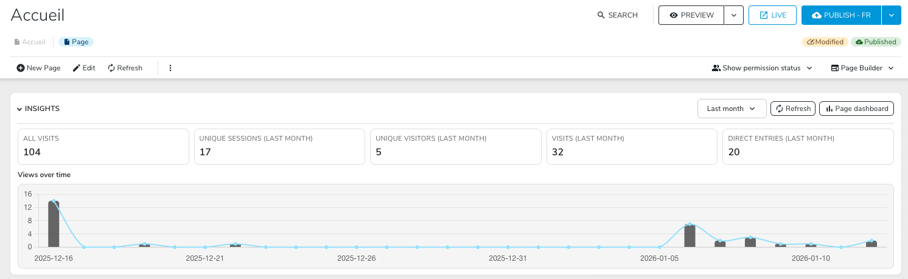

# Page Insights Module

Page Insights is a Jahia module that adds an insights widget to the JContent page header. It queries jExperience/Unomi through the built-in proxy to show visit metrics and a time-series chart for the current page.

## Features

- Summary metrics: all visits, visits in range, unique sessions, unique visitors, direct entries
- Time range selector (today, last week, last month, last 3/6 months)
- Time-series chart of page views
- Refresh action with caching to avoid repeated calls
- Optional link to the jExperience dashboard when the dashboards module is installed

## Screenshot




## Requirements

- Jahia with the `jexperience` module installed
- Site must have `jexperience` and `page-insights` installed
- Optional: `jexperience-dashboards` to enable the dashboard button

## Getting Started

This module ships with a Docker-based development environment.

```bash
# Install dependencies
yarn install

# Start Jahia in Docker
docker compose up --wait

# Start the dev mode (watch build)
yarn dev
```

The watcher rebuilds the module whenever source files change.

## Commands

Run scripts with `yarn <script>`:

| Category     | Script                | Description                                                             |
| ------------ | --------------------- | ----------------------------------------------------------------------- |
| Build        | `build`               | Produces a deployable artifact that can be uploaded to a Jahia instance |
| Build        | `deploy`              | Pushes the build artifact to a Jahia instance                           |
| Development  | `dev` (alias `watch`) | Watches for changes and rebuilds the module                             |
| Code quality | `format`              | Runs Prettier (a code formatter) on your code                           |
| Code quality | `lint`                | Runs ESLint (a linter) on your code                                     |
| Utils        | `clean`               | Removes build artifacts                                                 |
| Utils        | `package`             | Packs distributions files in a `.tgz` archive inside the `dist/` folder |
| Utils        | `watch:callback`      | Called every time a build succeeds in watch mode                        |

## Usage

- Open JContent and navigate to a page.
- The Page Insights header appears for `jnt:page` nodes when the module is installed.
- Click the header to expand/collapse the insights content.

## Configuration

The module reads configuration from `window.contextJsParameters`:

- `contextJsParameters.config.pageInsights.unomiBaseUrl`: base URL for the Unomi proxy. If unset, the current origin is used.
- `contextJsParameters.siteKey` (or `contextJsParameters.site.key`): site key for the proxy path.

If your Unomi proxy is not on the same origin, inject `unomiBaseUrl` via your Jahia configuration so the UI can reach `/modules/jexperience/proxy/<siteKey>` on the correct host.

## Data Source

The UI calls the jExperience proxy endpoints to fetch:

- Total page views (all time)
- Page views in the selected time range (daily aggregation)
- Direct entries
- Unique sessions and visitors

Requests are executed via `/modules/jexperience/proxy/<siteKey>` and cached per page/range in the browser to reduce round-trips.

## Localization

Translations live in `settings/locales/` under the `page-insights` namespace. Add or update keys there to localize the UI.

## Project Structure

- `src/pageInsightsBlock.tsx`: page header UI and chart rendering
- `src/unomiInsightsService.js`: Unomi proxy calls, caching, and normalization
- `src/init.tsx`: UI extender registration
- `settings/locales/`: i18n resources

## Deployment

To deploy to a Jahia instance, ensure `.env` has valid credentials and host, then run:

```bash
yarn build
yarn deploy
```

You can edit `.env` to match your environment (defaults are provided).

## Troubleshooting

- No widget appears: verify the `jexperience` module and `page-insights` are installed on the site.
- Errors in the widget: check the Unomi proxy availability and response status. If your proxy requires auth, add headers in `src/unomiInsightsService.js`.

